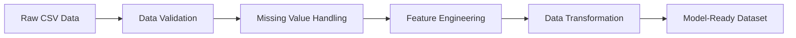

# Sales Analytics System with Machine Learning

## 📊 Project Overview

This project is a comprehensive **Sales Analytics System** that combines advanced data processing, machine learning models, and interactive visualization to analyze sales data and provide business intelligence insights. The system processes sales data from CSV files and provides predictive analytics through multiple ML models.

## 🎯 What We Analyzed

Our analysis focuses on **sales performance prediction** using historical sales data with the following key aspects:

### Data Analysis Scope
- **Sales Performance**: Revenue trends, order patterns, and customer behavior
- **Product Analysis**: Product line performance and profitability
- **Geographic Insights**: Territory-based sales distribution and performance
- **Customer Segmentation**: Customer behavior patterns and lifetime value
- **Temporal Patterns**: Seasonal trends, quarterly performance, and year-over-year growth
- **Profit Prediction**: Machine learning models to predict future profitability

### Key Metrics Analyzed
- Total Sales Revenue
- Order Quantities and Frequencies  
- Customer Acquisition and Retention
- Product Line Profitability
- Geographic Sales Distribution
- Deal Size Categories (Small, Medium, Large)
- Seasonal Sales Patterns

## 🤖 Machine Learning Models - Differences & Capabilities

The system implements **5 different machine learning models** for profit prediction, each with unique strengths:

### 1. **Linear Regression**
- **Type**: Simple linear model
- **Best For**: Understanding basic relationships between features
- **Strengths**: Fast, interpretable, good baseline
- **Use Case**: Initial analysis and feature importance understanding

### 2. **Random Forest**
- **Type**: Ensemble method using multiple decision trees
- **Best For**: Handling non-linear relationships and feature interactions
- **Strengths**: Robust to outliers, provides feature importance, handles missing values
- **Use Case**: General-purpose prediction with good accuracy and interpretability

### 3. **Gradient Boosting**
- **Type**: Sequential ensemble method
- **Best For**: High accuracy predictions with complex patterns
- **Strengths**: Excellent predictive performance, handles various data types
- **Use Case**: When accuracy is priority over interpretability

### 4. **XGBoost**
- **Type**: Optimized gradient boosting framework
- **Best For**: Competition-level accuracy and performance
- **Strengths**: Fast training, excellent performance, built-in regularization
- **Use Case**: Production environments requiring high accuracy and speed

### 5. **LightGBM**
- **Type**: Gradient boosting with leaf-wise tree growth
- **Best For**: Large datasets and fast training
- **Strengths**: Memory efficient, fast training, high accuracy
- **Use Case**: Big data scenarios and real-time predictions

## 🔍 Project Exploration Process

### 1. **Data Discovery Phase**
```
📁 Data Loading → 🔍 Initial Exploration → 📊 Statistical Analysis
```
- Load sales data from CSV files
- Examine data structure, types, and quality
- Identify missing values and outliers
- Generate descriptive statistics

### 2. **Data Processing Pipeline**
```
🔧 Data Cleaning → ⚡ Feature Engineering → 🎯 Target Creation
```
- Handle missing values and data inconsistencies
- Create derived features (profit margins, customer segments)
- Engineer temporal features (quarters, seasons)
- Prepare target variable (TOTAL_PROFIT)

### 3. **Exploratory Data Analysis (EDA)**
```
📈 Trend Analysis → 🗺️ Geographic Patterns → 👥 Customer Insights
```
- Sales trends over time
- Product performance analysis
- Geographic distribution patterns
- Customer behavior segmentation

### 4. **Model Development**
```
🏗️ Model Training → 📊 Performance Evaluation → 🎯 Model Selection
```
- Train multiple ML models simultaneously
- Compare performance using R², RMSE, MAE metrics
- Select best performing model for predictions
- Implement hyperparameter tuning

## 🔮 What Our Models Can Predict

### Primary Predictions
1. **Profit Forecasting**: Predict future profit based on sales patterns
2. **Sales Revenue**: Estimate expected sales for different scenarios
3. **Customer Lifetime Value**: Predict long-term customer value
4. **Product Performance**: Forecast product line success
5. **Seasonal Trends**: Predict seasonal sales variations

### Business Intelligence Insights
- **Risk Assessment**: Identify potential revenue risks
- **Opportunity Identification**: Spot high-potential markets/products
- **Resource Optimization**: Optimize inventory and marketing spend
- **Strategic Planning**: Data-driven business strategy recommendations

### Scenario Analysis
- **What-if Analysis**: Impact of pricing changes, market expansion
- **Growth Projections**: Future revenue under different growth scenarios
- **Market Penetration**: Potential in new geographic markets

## 📊 Data Processing Workflow

### Original Data → Clean Data Process



### 1. **Raw Data Input**
- **Source**: CSV files with sales transactions
- **Format**: Structured data with columns for orders, customers, products, dates
- **Size**: Handles datasets from small (1K rows) to large (1M+ rows)

### 2. **Data Cleaning Process**
```python
# Key cleaning steps implemented:
- Remove duplicate records
- Handle missing values (imputation/removal)
- Standardize date formats
- Validate data types and ranges
- Remove outliers (optional)
```

### 3. **Feature Engineering**
```python
# New features created:
- TOTAL_PROFIT = SALES - (QUANTITY × PRICE × 0.7)
- CUSTOMER_SEGMENT = Based on sales volume
- PROFIT_MARGIN = (PRICE - MSRP) / MSRP × 100
- Temporal features: YEAR, MONTH, QUARTER, DAY_OF_WEEK
- Geographic encoding: TERRITORY_RANK
- Deal size encoding: DEALSIZE_NUMERIC
```

### 4. **Data Transformation**
- **Encoding**: Convert categorical variables to numerical
- **Scaling**: Standardize features for linear models
- **Aggregation**: Create summary statistics and ratios
- **Validation**: Ensure data quality and consistency

### 5. **Model-Ready Output**
- **Features (X)**: Numerical matrix ready for ML algorithms
- **Target (y)**: TOTAL_PROFIT values for supervised learning
- **Splits**: Training/testing datasets for model validation

## 🚀 Getting Started

### Prerequisites
```bash
Python 3.8+
pip install -r requirements.txt
```

### Installation & Usage
```bash
# Clone the repository
git clone <repository-url>
cd sales-analytics-system

# Install dependencies
pip install -r requirements.txt

# Run the application
streamlit run main.py
```

### Data Requirements
- CSV file with sales data
- Required columns: SALES, QUANTITYORDERED, PRICEEACH, ORDERDATE
- Optional columns: CUSTOMERNAME, PRODUCTLINE, TERRITORY, etc.

## 📈 Key Features

### Interactive Dashboard
- **Real-time Analytics**: Live data processing and visualization
- **Filtering**: Dynamic filtering by date, product, territory, customer
- **Drill-down**: Detailed analysis capabilities
- **Export**: Export insights and predictions

### Advanced Analytics
- **Predictive Modeling**: Multiple ML algorithms for accurate predictions
- **Statistical Analysis**: Comprehensive statistical insights
- **Trend Analysis**: Identify patterns and trends in sales data
- **Performance Metrics**: Track KPIs and business metrics

### Business Intelligence
- **Strategic Insights**: Data-driven business recommendations
- **Risk Assessment**: Identify potential business risks
- **Opportunity Analysis**: Discover growth opportunities
- **ROI Analysis**: Calculate return on investment for different strategies

## 🛠️ Technical Architecture

```
Frontend (Streamlit) → Data Processor → Model Manager → Analytics Engine
                    ↓
              Dashboard Components → Visualizations & Reports
```

### Core Components
- **`main.py`**: Main application and UI controller
- **`data_processor.py`**: Data loading, cleaning, and preprocessing
- **`model_manager.py`**: ML model training, evaluation, and prediction
- **`analytics_engine.py`**: Advanced analytics and business intelligence
- **`dashboard_components.py`**: Reusable UI components

## 📊 Performance Metrics

The system tracks multiple performance indicators:
- **Model Accuracy**: R² Score, RMSE, MAE for each model
- **Processing Speed**: Data loading and model training times
- **Business Impact**: Revenue predictions vs. actual performance
- **User Engagement**: Dashboard usage and interaction metrics

## 🔧 Configuration

### Model Configuration
- Adjustable hyperparameters for each ML model
- Cross-validation settings
- Feature selection options
- Performance thresholds

### Data Configuration
- Flexible data schema support
- Custom feature engineering rules
- Data validation parameters
- Processing optimization settings

## 📝 License

This project is licensed under the MIT License - see the [LICENSE](LICENSE) file for details.

## 🤝 Contributing

1. Fork the repository
2. Create a feature branch (`git checkout -b feature/AmazingFeature`)
3. Commit your changes (`git commit -m 'Add some AmazingFeature'`)
4. Push to the branch (`git push origin feature/AmazingFeature`)
5. Open a Pull Request

## 📞 Support

For support and questions:
- Create an issue in the repository
- Check the documentation
- Review the code examples

---

**Built with ❤️ for data-driven business intelligence**